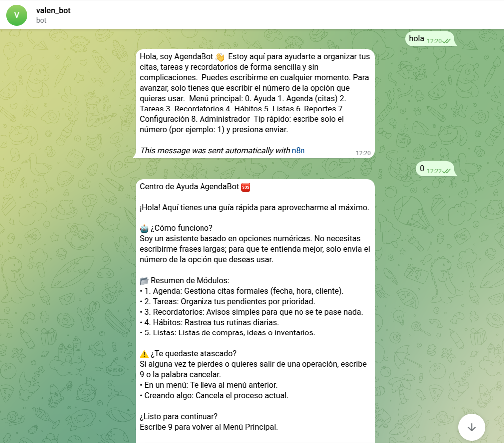
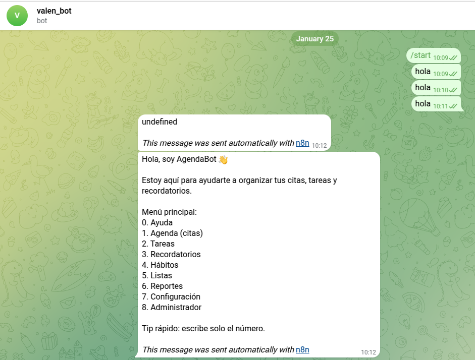
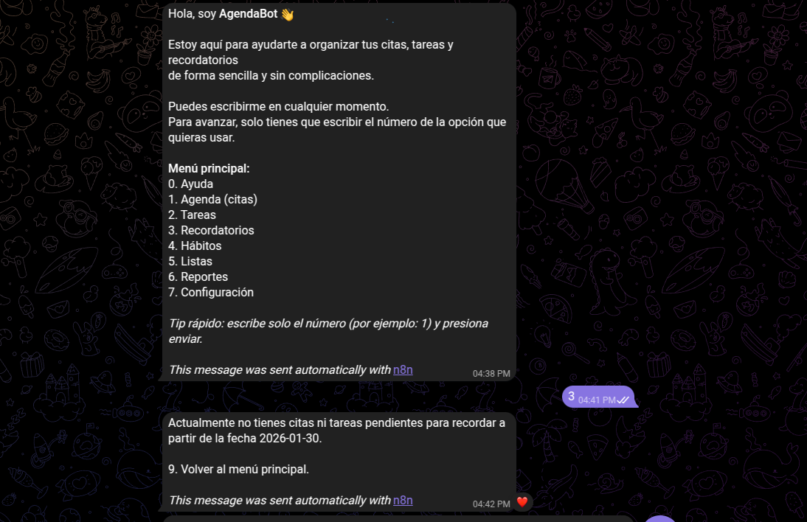
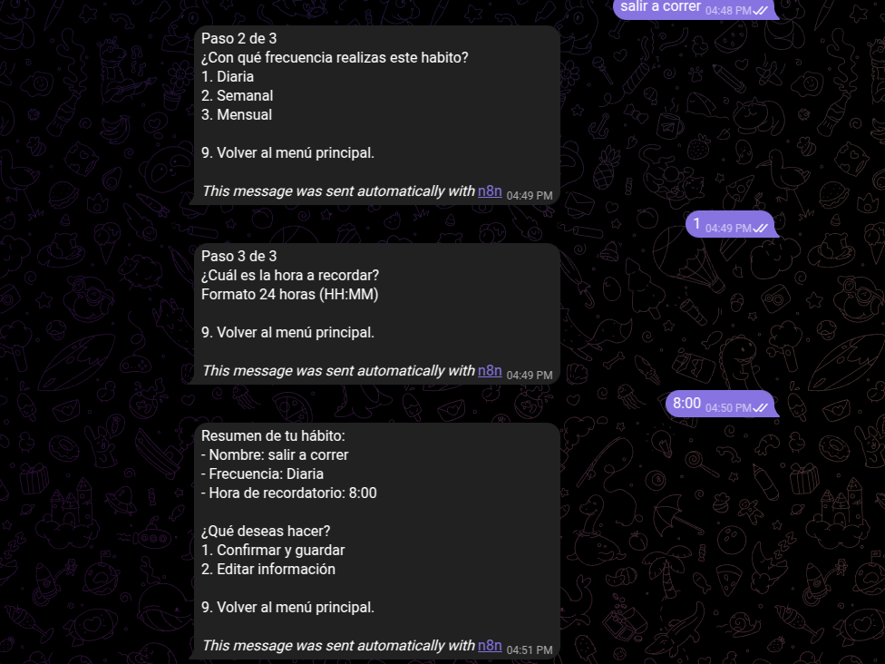
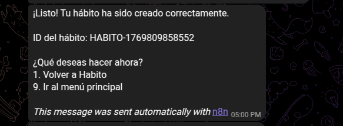
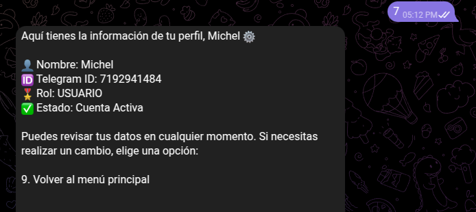
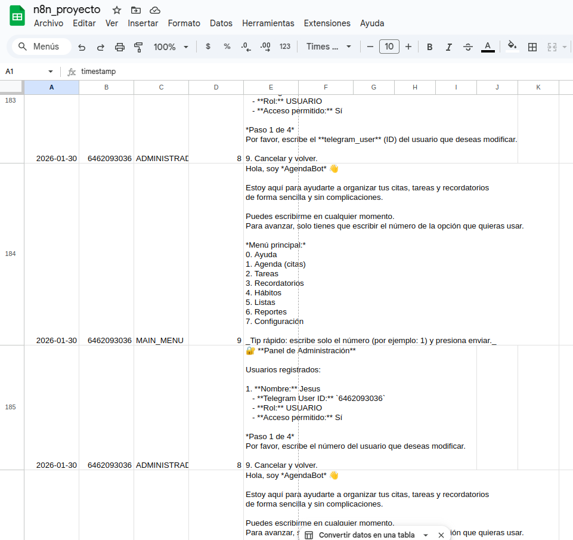
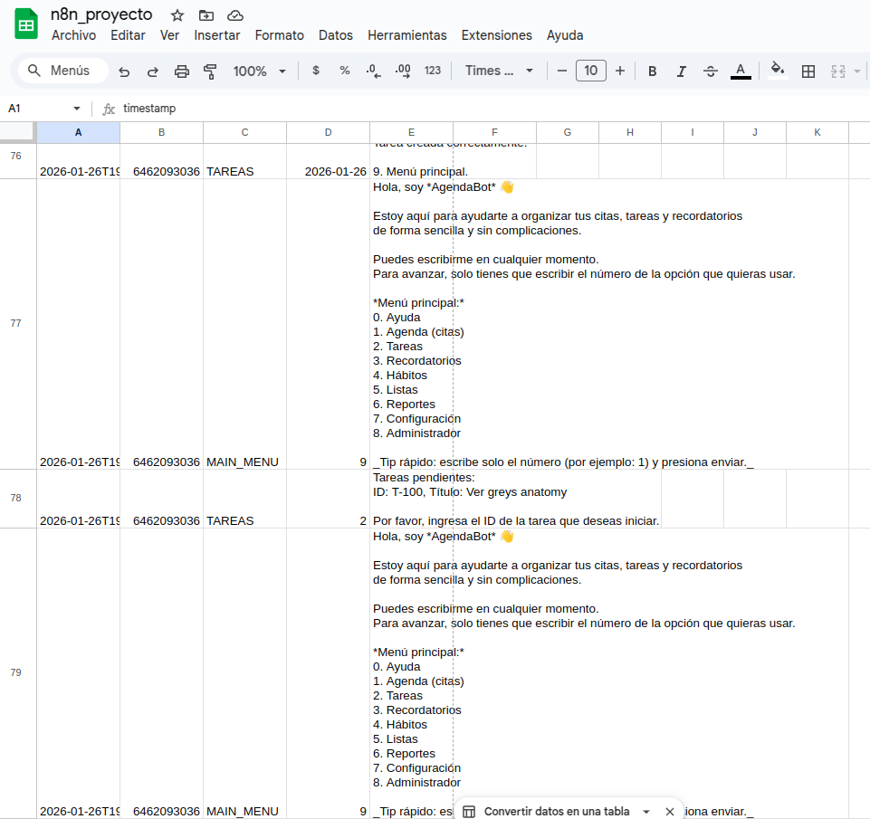
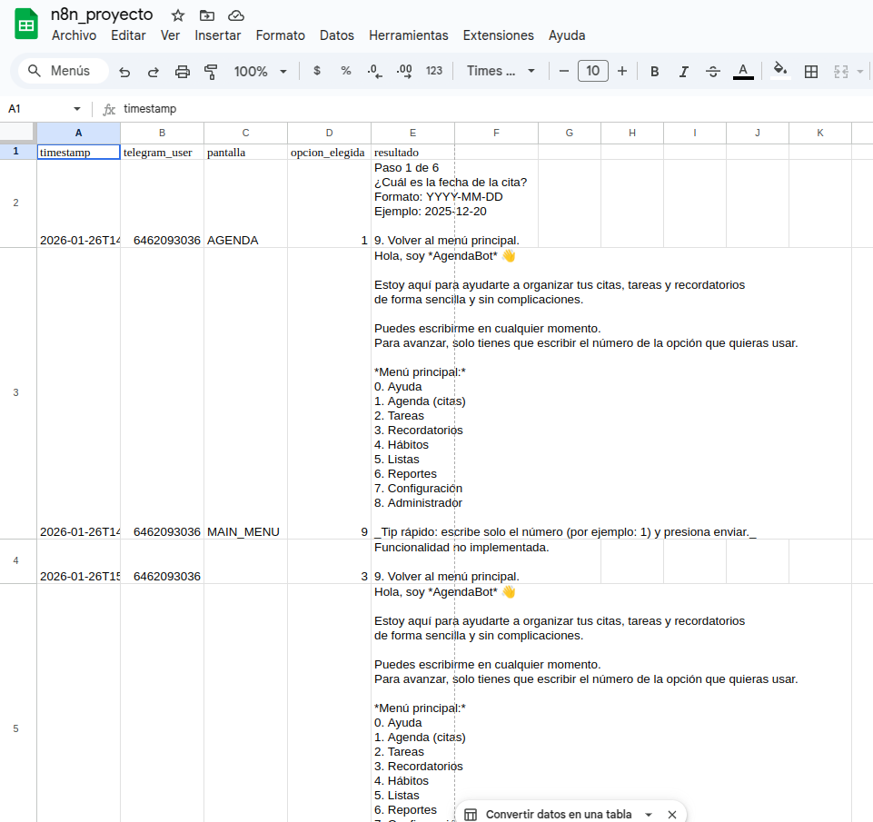

# docs valen_Bot
- El presente documento recopila las pruebas de funcionamiento de un agente Bot, un sistema de gestión basado en una arquitectura de estados. Las evidencias aquí presentadas se dividen en dos capas fundamentales que demuestran la integridad del flujo de trabajo:

## Pruebas de Interacción (Telegram)
- **Bienvenida Automática:**  Al recibir el primer mensaje ("hola"), el bot identifica que no hay un estado previo y despliega el Menú Principal con opciones del 0 al 8.

Gestión de Ayuda (Opción 0): Se observa que al enviar el número "0", el bot cambia su estado y responde correctamente con el Centro de Ayuda, explicando los módulos (Agenda, Tareas, etc.) y la regla global del número 9 para cancelar o volver al inicio.

## correcion del menú
- **Se puede observas como su vista es mejor que la imagen anterior**

## Tareas 
- se puede observar como el usuario selecciona la opcion numero 2 para crear una tarea y de ahi la respuesta del bot para mostrar al usuario el siguiente menu para asi crear la tarea respectiva que  el usuario desee o iniciar, modificarla, eliminarla o simplemente volver al menu principal

## Recordatorios
- Aquí se puede observar como por el momento no tiene creado un asunto para tomarlo como recordatorio y tiene la opción de volver al menú principal

## Habitos
- La opción hábitos se realiza en tres pasos como se pueden observar en las imágenes, en la primera opción de hacer un habito el bot le pregunta al usuario el nombre del habito, luego el le preguntara con que frecuencia lo va realizar (diariamente, semanalmente o mensualmente ), y por ultimo paso le preguntara la hora a recordar para que cumpla con ese habito que va realizar, por ultimo le dará un resumen de acuerdo a su habito, le dará la opción de confirmar y guardar o editar su información si desea cambiar algún dato 
 
 
 
 ## LIstas
 - 
 ## Repotes

 - 
 ## configuracion
 - Aqui nos enseña como es nuestra informacion como usuario 
 

## Evidencia (Google sheets)

Aquí donde se muestra como con google sheets podemos guardar correctamente la informacion que el bot resive del usuario 

